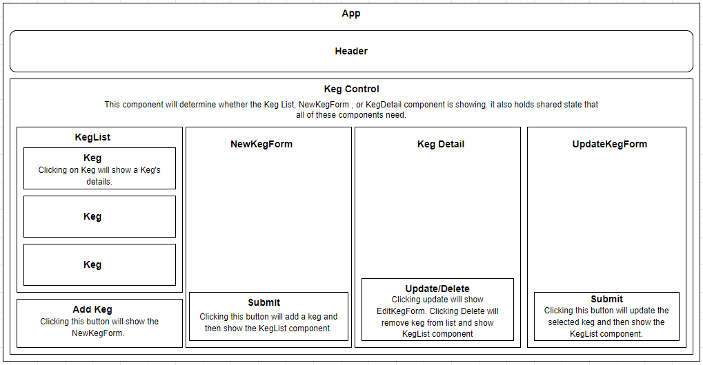

# React Tap

### A React app that tracks kegs of beer including details like price, alcohol content and more.
### By Shaun Kent

## Technologies Used

* HTML
* CSS
* Javascript
* React
* Node Package Manager (npm)
* ESLint
* Webpack

## Description

A React app that can keep track of kegs at a bar. The application is able to track specific details about a keg like name, brand, price, alcohol content, and pints in stock. The app also allows the user to add new kegs to the system and update existing kegs. The user can buy and restock a specific keg on the details page. 

## Component Diagram

## Setup/Instillation Requirements

* Go to this link: `https://github.com/SKona306/ReactTap`

* In the right hand corner click the green button that says `code`.

* Copy the HTTPS link.

* Open a command prompt and traverse to the directory you want the project stored in.

* In command line enter `git clone [copied HTTPS link]`.

* Open project in code editor of choice.

* To install dependencies travel to the root directory then enter command `npm install`.

* To start app enter `npm start` in command line.

* To exit live server press CTRL + `c`.

## Known Bugs

* No known bugs currently

## License 

[MIT](https://choosealicense.com/licenses/mit/)

## Contact Information

* shaunkent81@gmail.com
